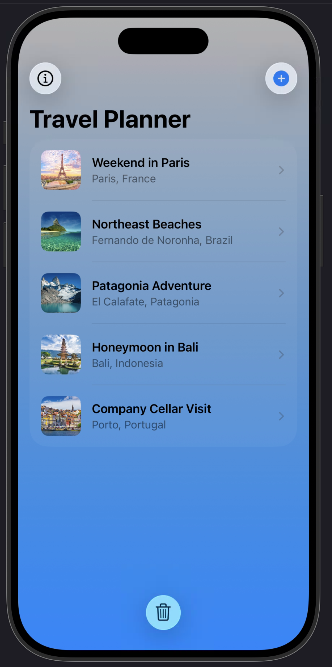
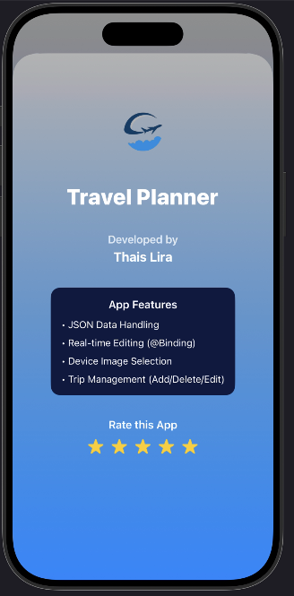
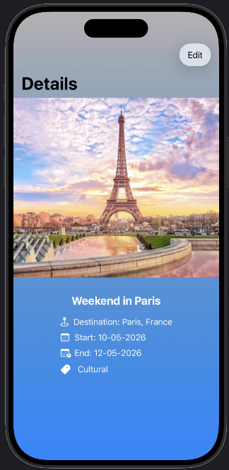

# ✈️ Travel Planner

> A simple and intuitive iOS application developed with SwiftUI to help users organize their upcoming trips.  
> This project was created as part of a mobile development assessment.

---

## 📌 Project Overview

This project is a modern travel planning app designed to make trip organization simple and visually appealing.  
The application allows users to manage their trips with full CRUD functionality while maintaining a clean and elegant interface.

---

## ✨ Features

### 📂 JSON Integration
Loads a pre-defined list of trips from a local JSON file using the Codable protocol.

### 🖼️ Custom Photos
Users can select real photos directly from their device’s gallery using **PhotosUI**.

### 🔄 Full CRUD Operations

- **Create**: Add new trips with name, destination, and travel dates.
- **Read**: View trip details on a dedicated screen.
- **Update**: Edit trip information dynamically using `@Binding`.
- **Delete**: Remove individual trips or clear the entire list.

---

## 🎥 PrintScreen

  
  
  

---

## 🛠️ Tech Stack

- **Language:** Swift 5.10  
- **Framework:** SwiftUI  
- **Media:** PhotosUI & SF Symbols  
- **Data Handling:** JSON (Codable Protocol)

---

## 👩‍💻 Author

Developed by **Thais Lira**
